#### [Live link to deployed project](https://loosenthedark.github.io/brew-barberista) (hosted on GitHub Pages)

Brew Barberista is a thriving independent coffee shop and barber in North Dublin. Opening its doors at the height of lockdown, the business has not only survived this period of uncertainty, it has established itself as a community hub, showcasing the best of local produce as well as selling art and literature from Dublin-based creatives.

While the company has made good use of social media (notably Instagram) throughout its early days, one thing the pandemic has brought home to business owners everywhere is the importance of building a robust and reliable online presence - something that can remain as a 'shop window' for customers even when physical premises might have to close their doors due to restrictions tightening.

At the time of writing, the company's existing site appears to be unfinished, while it is also displaying out-of-date information about opening hours etc. (last updated in December 2020). In addition, it falls well short of being sufficiently responsive for today's mobile-first consumer landscape:

mobile  |  tablet  |  desktop
:-------------------------:|:-------------------------:|:-------------------------:
[Home](docs/images/screenshots/old-site/brew-barberista-home-mobile.png)  |  [Home](docs/images/screenshots/old-site/brew-barberista-home-tablet.png) |  [Home](docs/images/screenshots/old-site/brew-barberista-home-desktop.png)
[Brew Coffee](docs/images/screenshots/old-site/brew-barberista-coffee-mobile.png)  |  [Brew Coffee](docs/images/screenshots/old-site/brew-barberista-coffee-tablet.png) |  [Brew Coffee](docs/images/screenshots/old-site/brew-barberista-coffee-desktop.png)
[Brew Barber](docs/images/screenshots/old-site/brew-barberista-barber-mobile.png)  |  [Brew Barber](docs/images/screenshots/old-site/brew-barberista-barber-tablet.png) |  [Brew Barber](docs/images/screenshots/old-site/brew-barberista-barber-desktop.png)

> Brew Barberista old website screenshots

Add to all of this the ongoing #DeleteFacebook movement and growing public concern over the lack of privacy across SNSs, and there is clearly a need for Brew Barberista to consolidate its brand identity and ties to the community by creating a bright and engaging standalone website.

## User Experience (UX)

[**Brew Barberista**](https://loosenthedark.github.io/brew-barberista) is a fully-responsive frontend website, offering users a visually appealing overview of the business's services, local partnerships and core values. Both first-time and returning visitors will be impressed by the site's mobile-first design as well as its intuitive navigation and layout, while their knowledge of Brew Barberista's offerings and message will be enriched by the site's informative and regularly-updated content.

### User stories:

#### User goals (general visitor to the site):

#### Developer goals:

## Project design

### Colour scheme:

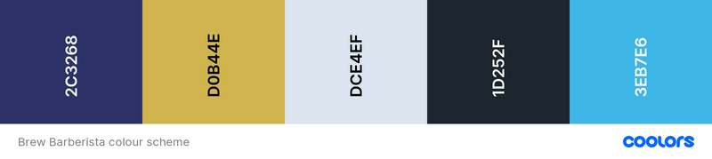

### Typography:

#### Primary font...

Family: [Poppins](https://fonts.google.com/specimen/Poppins)
Weights: 300, 400, 500
Fallback: `sans-serif`

#### Secondary (Heading) font...

Family: [Lora](https://fonts.google.com/specimen/Lora)
Weights: 600, 700
Fallback: `serif`

#### Wireframes:

## Features

### Existing features:

- Navigation:

  - Fixed Navigation Bar:

      |  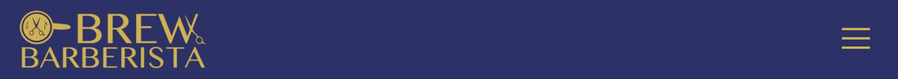  |  
    :-------------------------:|:-------------------------:|:-------------------------:
    mobile  |  tablet |  desktop

    - There is a full-width nav bar fixed to the top of the viewport on all device sizes
    - The site's core navigation menu is hidden off-canvas initially to create a spacious feel across the landing area, where the user is greeted by the Brew Barberista `.navbar-logo` on the left-hand side and a `.navbar-toggler` button (aka 'hamburger icon') to the right (see screenshots above)
    - This logo is a modified version of the one featured in the nav bar of [the business's existing website](http://brewbarberista.ie/)
    - The ['space cadet' dark blue and 'old gold' colours that make up this logo](http://brewbarberista.ie/resources/Circular%20logo.jpg) directly inform this project's primary palette. A lighter shade of 'cyan process' blue [(featured throughout the current site's `footer`, for instance)](https://loosenthedark.github.io/brew-barberista#contact) is taken directly from [the premises' brightly-painted shopfront](https://www.facebook.com/photo/?fbid=190590879506085&set=a.190590812839425).

  - (Off-Canvas) Navigation Menu:

    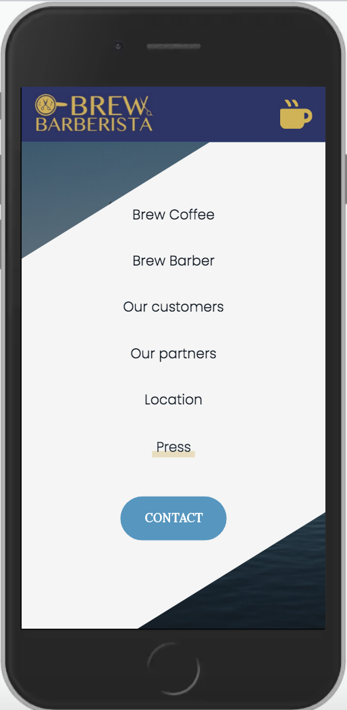  |    |  
    :-------------------------:|:-------------------------:|:-------------------------:
    mobile  |  tablet |  desktop

    - The off-canvas `navbar-nav` menu mentioned above can be expanded by clicking on the `.navbar-toggler` button. This functionality has been enabled using vanilla JavaScript by listening for a relevant user click(s) and sliding the `.navbar-nav` into the viewport with CSS class toggling involving `absolute` positioning and appropriate transition effects. In addition, the icon comprising the `.navbar-toggler` button animates on click to produce a dynamic yet smooth transition that is both distinctive and pleasing to the eye.
    - The expanded polygon-shaped menu contains links to each of the website's six internal sections containing content (see below), as well as a seventh link entitled 'Press'.
    - Clicking on this triggers an additional absolutely-positioned submenu featuring external links to recent Brew Barberista media appearances. Each of these links opens in a new browser tab due to the `<a>` tag's `target` property being set to `_blank`.
    - The bottom 'Contact' link consists of a cyan call-to-action `button`. In keeping with UX best practices, clicking on any of the links embedded in the `.navbar-nav` will cause the menu to revert to its default off-canvas location as the site navigates to the designated location. Smooth scrolling has been enabled to streamline the navigation experience through use of the `scroll-behavior: smooth;` CSS rule on the document's `body` element.
    - NB: One further section of the site, a tiled image gallery, is purely decorative, and so no anchor link is required.

    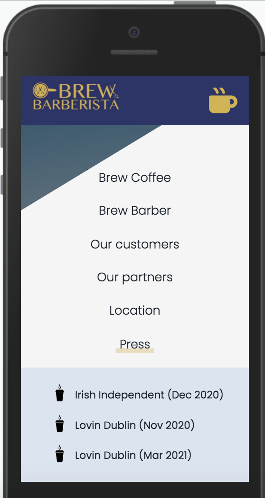  |    |  
    :-------------------------:|:-------------------------:|:-------------------------:
    mobile  |  tablet |  desktop

- Header:

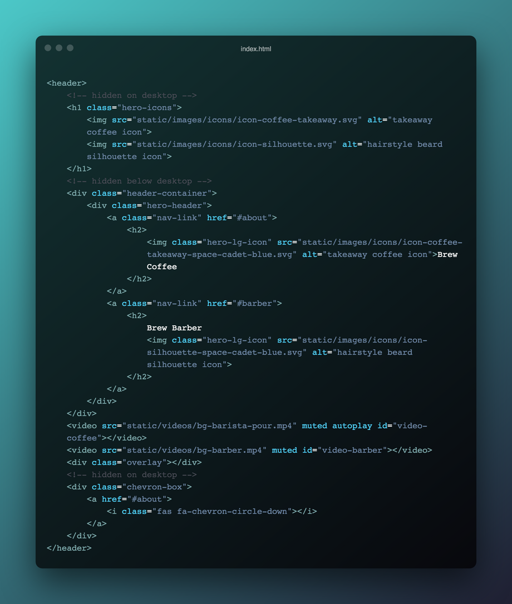  |  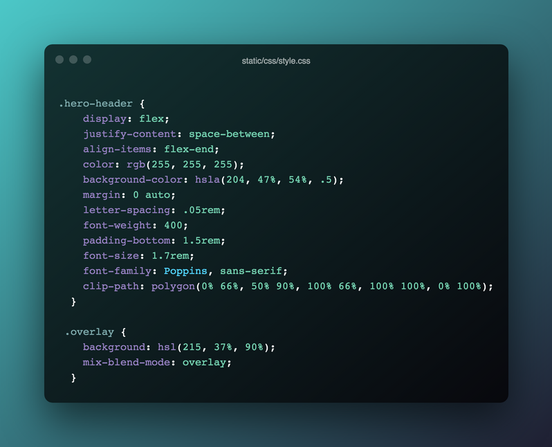
:-------------------------:|:-------------------------:
`<header>` HTML code snippet  |  `.hero-header` and `.overlay` CSS code snippets

  |    |  
:-------------------------:|:-------------------------:|:-------------------------:
mobile  |  tablet |  desktop

  - Mobile & Tablet (< 992px):

    - The site's above-the-fold real estate on mobile and tablet features a clean, soothing background image of a horizon out to sea. This was chosen due to Brew Barberista's prime location just off the Howth Road in Raheny and less than a kilometre uphill from the Dublin Bay coast road.
    - On page load this landing area is brought to life using animated hero icons: one of a takeaway cup of hot coffee, the other a silhouette of a man with a striking hairstyle. These icons have been enlarged and had a 'zoom-into-view' `@keyframes icon-reveal` animation effect applied to them in order to capture the visitor's attention and also hint at the services available at Brew Barberista.

  - Desktop (> 991px):

    - A decision was made to change the `header` area's aesthetic on desktop devices. In place of the background image with animated icons are two short complimentary video backgrounds: one showing a barista pouring a cup of coffee, the other featuring a close-up of a barber trimming a customer's hair.
    - Each of these `video` elements has had its `opacity` reduced to keep them from being seen to occupy the foreground (and/or overly distract the user).
    - There has also been an `.overlay` class applied to an absolutely-positioned `div` element that acts as a subtle filter in line with the site's prevailing colour palette
    - One more additional `div` with `background-color` set to semi-opaque blue has had a `clip-path` rule applied to it. This has the effect of creating a symmetrical pair of roughly triangular 'corner areas', each containing an icon and a heading, which act as navigation links to 'Brew Coffee' and 'Brew Barber', respectively.

- Main:

  - About section:

  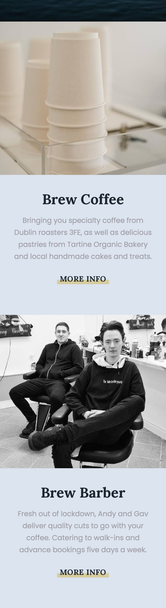  |  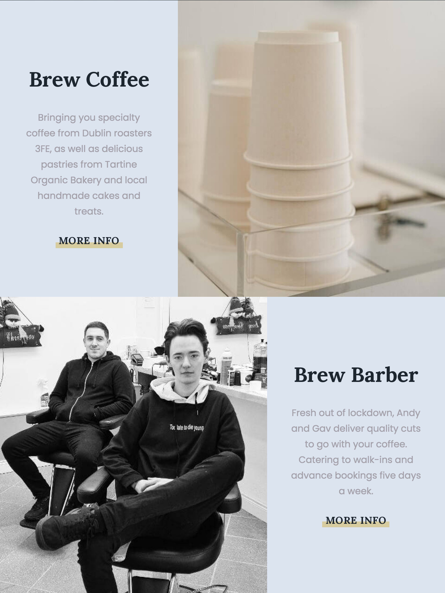  |  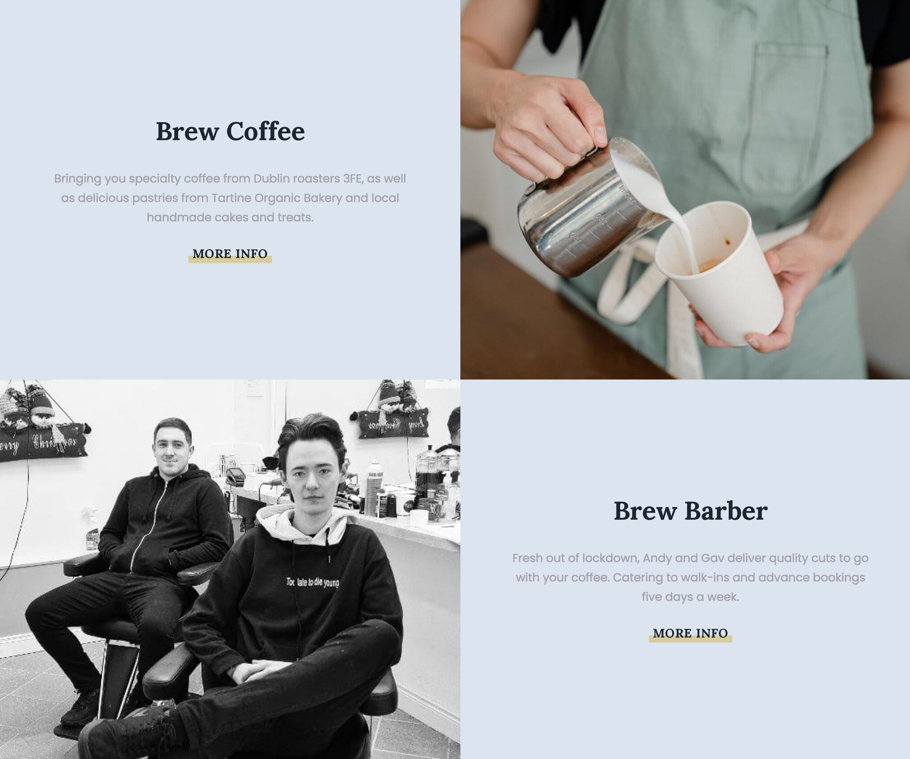
  :-------------------------:|:-------------------------:|:-------------------------:
  mobile  |  tablet |  desktop

    - The site's first textual content appears in the area immediately below the `header` (referred to as the About section here for the sake of convenience). This section is in turn subdivided into two subsections, **Brew Coffee** and **Brew Barber**, each accompanied by eye-catching background imagery and short, snappy summaries of the two sides of Brew Barberista's operations:

  - More Info section:

  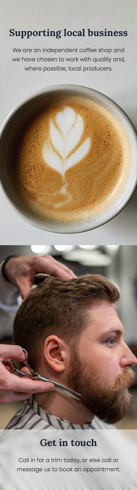  |    |  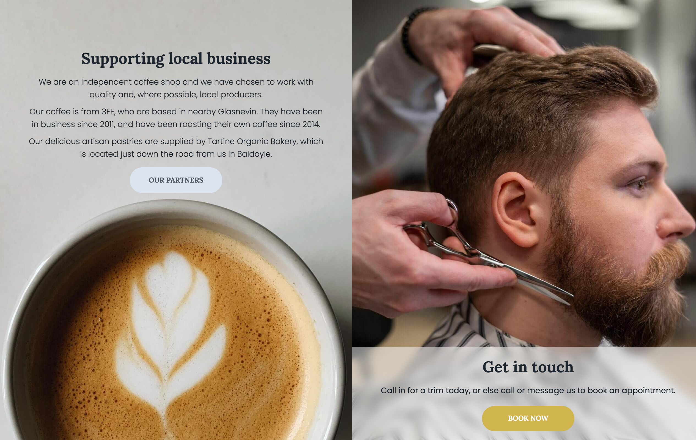
  :-------------------------:|:-------------------------:|:-------------------------:
  mobile  |  tablet |  desktop

    - Each About subsection contains a 'More Info' hyperlink, which brings the user to the relevant follow-on subsection for that Brew Barberista service (Brew Coffee/Brew Barber).
    - These two More Info subsections are stacked on mobile and tablet, and side by side on desktop
    - Each panel contains informative blurbs highlighting a variety of USPs offered by Brew Barberista. The text is set against carefully-positioned full-width and -height background images.
    - As screen width increases and space permits, several (initially hidden) elements are revealed across tablet and desktop devices. These include supplementary paragraphs of text and call-to-action `button`s.
    - The 'Our Partners' CTA `button` (visible on desktop only) in the Brew Coffee subsection directs the user to the 'Our Partners' section of the site (see below), while the 'Book Now' `button` (visible on tablet and desktop) beneath the 'Get in touch' Brew Barber heading causes the page to scroll right down to the `footer`, where the business's contact details can be found (see below). 

  - Customer Reviews
  - Image Gallery
  - Partners
  - Location
- Footer

### Potential future features:

## Technologies Used

### Languages:

- [HTML5:](https://en.wikipedia.org/wiki/HTML5) used for structuring the site
- [CSS3:](https://en.wikipedia.org/wiki/Cascading_Style_Sheets) used for styling the site
- [JavaScript:](https://en.wikipedia.org/wiki/JavaScript) used for site logic and web page behaviour

### Frameworks/Libraries, APIs, Programmes and Tools:

- [Google Fonts:](https://fonts.google.com/) used to import the Poppins and Lora fonts into the project's stylesheets
- [Font Awesome v5.15.3:](https://fontawesome.com/) used to add appropriate and visually appealing site icons
- [Google Maps API](https://developers.google.com/maps) used to provide a visual representation of Brew Barberista's location to site visitors
- [Git:](https://git-scm.com/) used for version control by utilising the Gitpod terminal to commit frequently to Git and push all commits to GitHub
- [GitHub:](https://github.com/) used to compile and remotely store the project's codebase following successive local commits initiated from the command line
- [Balsamiq:](https://balsamiq.com/) used to generate [wireframes](docs/wireframes/flippin-proud-wireframes.pdf) during the project's design phase
- [Adobe Illustrator:](https://www.googleadservices.com/pagead/aclk?sa=L&ai=DChcSEwjHh4e5sIXyAhXP6-0KHS7vASoYABAAGgJkZw&ae=2&ohost=www.google.com&cid=CAESQOD2cD2cs4zu4JpNTapSj1nbDmPmLIo3quvyOOMw9veyz__8LtydqbjQH8HTLrYcgDlnQb6l-F40o-SYGXLD1T0&sig=AOD64_0b1ay7NFSesjZymAaH8gGibU9W0w&q&adurl&ved=2ahUKEwiPv_64sIXyAhW8UBUIHS4nDYMQ0Qx6BAgCEAE) used to.....
- [TinyJPG:](https://tinyjpg.com/) used for image compression
- [PicResize:](https://picresize.com/) used to crop and resize images

## Testing

### Validation:

### Responsiveness:

### Bugs:

## Deployment

### GitHub Pages:

### Forking the GitHub Repository:

### Making a local clone:

## Credits

### Code:

### Content:

### Media:

| Media title/description  | Media format  | Website section  | Credit  | Link to original media source  | 
| :------------ |:---------------|:---------------|:-----|:---------------|
| 'Fashion silhouette hipster style'      | vector illustration  | `header`      | [RomanYa](https://www.shutterstock.com/g/RomanYa)      | [Shutterstock](https://www.shutterstock.com/image-vector/fashion-silhouette-hipster-style-vector-illustration-161463794)      |
| 'Paper mug with hot drink inside'      | vector illustration  | `header`      |[Agnieszka Karpinska](https://www.shutterstock.com/g/Panptys)      | [Shutterstock](https://www.shutterstock.com/image-vector/paper-mug-hot-drink-inside-vector-322930262)      |
| 'A Barista Making A Coffee Artistically'      | video  | `header`      | [Ketut Subiyanto](https://www.pexels.com/@ketut-subiyanto)      | [Pexels](https://www.pexels.com/video/a-barista-making-a-coffee-artistically-4378109/)      |
| 'Gmail New 2020 Vector'      | vector icon  | `footer`      | [IconApe](https://iconape.com/)      | [IconApe](https://iconape.com/gmail-new-2020-seeklogo-com-3-logo-icon-svg-png.html)      |
| 'Dog Friendly sign'      | image  | `footer`      | [SVGCraftLounge](https://www.etsy.com/ie/shop/SVGCraftLounge?ref=l2-about-shopname)      | [Etsy](https://www.etsy.com/ie/listing/1046348333/dog-friendly-sign-printable-and-cut-file?ga_order=most_relevant&ga_search_type=all&ga_view_type=gallery&ga_search_query=no+pets+allowed+png&ref=sr_gallery-2-26&pro=1)      |
| 'Cold Brew'      | photo  | `main > section#gallery`      | [Andrew "Donovan" Valdivia](https://unsplash.com/@donovan_valdivia?utm_source=unsplash&utm_medium=referral&utm_content=creditCopyText)      | [Unsplash](https://unsplash.com/photos/mMI5sdLFoHMt)      |
| 'Anonymous barista pouring milk from jug into paper cup'      | photo  | `header`      | [Ketut Subiyanto](https://www.pexels.com/@ketut-subiyanto)      | [Pexels](https://www.pexels.com/photo/anonymous-barista-pouring-milk-from-jug-into-paper-cup-4350051/)      |
| barber's kit against orange background      | photo  | `main > section#gallery`      | [Sinval Carvalho](https://unsplash.com/@sinvalbmx)      | [Unsplash](https://unsplash.com/photos/WbEibGKHBMY)      |
| 'Baked Pastries'      | photo  | `main > section#gallery`      | [Magda Ehlers](https://www.pexels.com/@magda-ehlers-pexels)      | [Pexels](https://www.pexels.com/photo/baked-pastries-2573870)      |
| 'Brown Coffee Beans on Gray Textile'      | photo  | `main > section#gallery`      | [Liana Horodetska](https://www.pexels.com/@liana-horodetska-5077625)      | [Pexels](https://www.pexels.com/photo/dawn-caffeine-coffee-dark-7507365/)      |
| 'Crop barista pouring milk froth in cappuccino for client'      | photo  | `main > section#about`      | [Ketut Subiyanto](https://www.pexels.com/@ketut-subiyanto)      | [Pexels](https://www.pexels.com/photo/crop-barista-pouring-milk-froth-in-cappuccino-for-client-4349759/)      |
| 'Man in White and Black Stripe Shirt Holding Black Pen'      | photo  | `main > section#more-info`      | [cottonbro](https://www.pexels.com/@cottonbro)      | [Pexels](https://www.pexels.com/photo/man-in-white-and-black-stripe-shirt-holding-black-pen-3998429/)      |
| 'White Ceramic Mug With Brown Liquid'      | photo  | `main > section#more-info`      | [Gareth Rees](https://www.pexels.com/@gareth-rees-2793957)      | [Pexels](https://www.pexels.com/photo/white-ceramic-mug-with-brown-liquid-4334758/)      |
| 'Straight Razor Kit'      | photo  | `main > section#gallery`      | [Josh Sorenson](https://www.pexels.com/@joshsorenson)      | [Pexels](https://www.pexels.com/photo/straight-razor-kit-995300/)      |
| 'Set of disposable paper coffee cups'      | photo  | `main > section#about`      | [Ketut Subiyanto](https://www.pexels.com/@ketut-subiyanto)      | [Pexels](https://www.pexels.com/photo/set-of-disposable-paper-coffee-cups-4349942/)      |
| 'Calm Sea Under Blue Sky'      | photo  | `header`      | [cottonbro](https://www.pexels.com/@cottonbro)      | [Pexels](https://www.pexels.com/photo/calm-sea-under-blue-sky-4571251)      |

### Acknowledgements:

### Notice:
