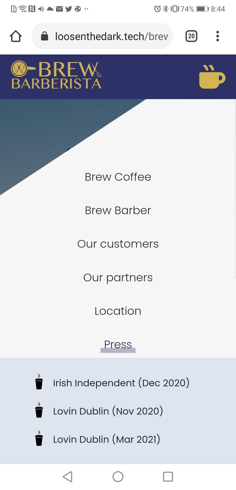
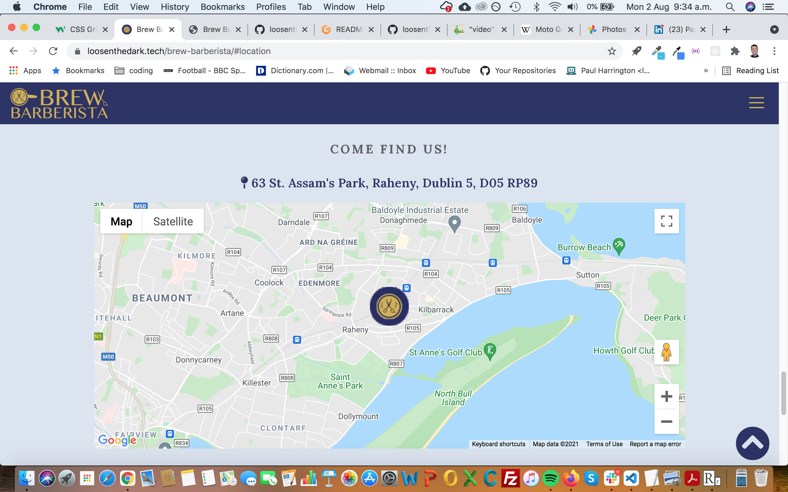
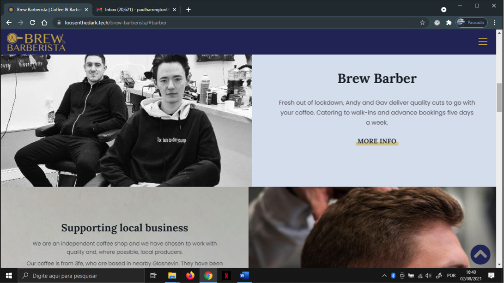
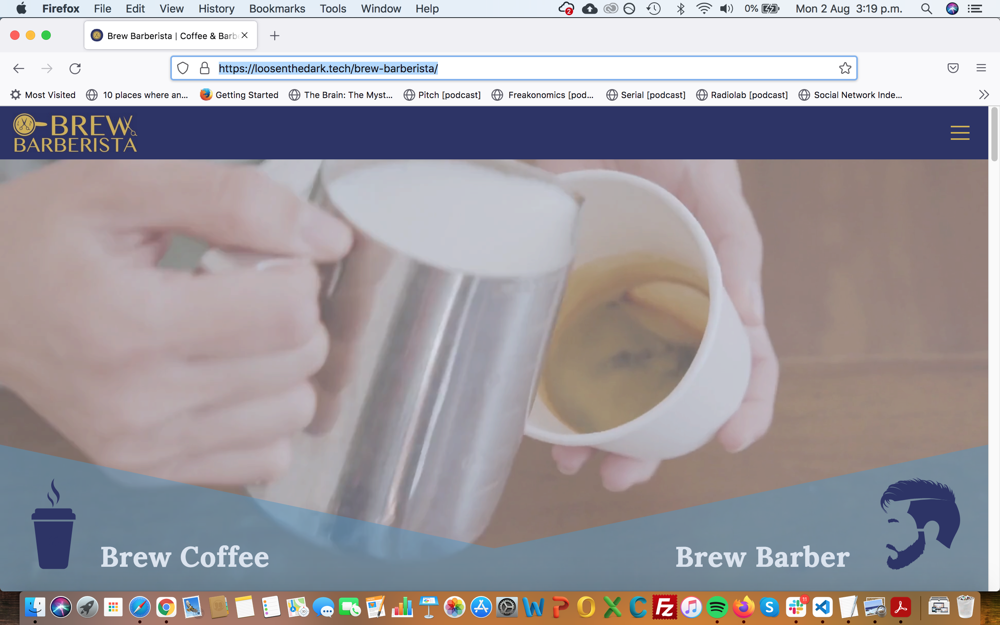

#### [Live link to deployed project](https://loosenthedark.tech/brew-barberista/) (loosenthedark.tech)

***_**NB: This project is an expanded version of the original (built in July 2021), the repository for which can be found [here](https://github.com/loosenthedark/brew-barberista)**_***

[Brew Barberista](http://brewbarberista.ie/) is a thriving independent coffee shop and barber in North Dublin. Opening its doors at the height of lockdown, the business has not only survived this period of uncertainty, it has firmly established itself as a community hub, showcasing the best of local produce as well as selling art and literature from Dublin-based creatives.

While the company has made good use of social media (notably [Instagram](https://www.instagram.com/brewbarberista/)) throughout its early days, one thing the pandemic has brought home to business owners everywhere is the importance of building a robust and reliable online presence - something that can remain as a proverbial shop window for customers if and when physical premises might have to close their doors due to Covid restrictions.

At the time of writing, the company's [existing site](http://brewbarberista.ie/) appears to be somewhat unfinished, while it is also displaying out-of-date information about opening hours etc. (last updated in December 2020). In addition, its design falls well short of being sufficiently responsive for today's mobile-first consumer landscape:

mobile  |  tablet  |  desktop
:-------------------------:|:-------------------------:|:-------------------------:
[Home](docs/images/screenshots/old-site/brew-barberista-home-mobile.png)  |  [Home](docs/images/screenshots/old-site/brew-barberista-home-tablet.png) |  [Home](docs/images/screenshots/old-site/brew-barberista-home-desktop.png)
[Brew Coffee](docs/images/screenshots/old-site/brew-barberista-coffee-mobile.png)  |  [Brew Coffee](docs/images/screenshots/old-site/brew-barberista-coffee-tablet.png) |  [Brew Coffee](docs/images/screenshots/old-site/brew-barberista-coffee-desktop.png)
[Brew Barber](docs/images/screenshots/old-site/brew-barberista-barber-mobile.png)  |  [Brew Barber](docs/images/screenshots/old-site/brew-barberista-barber-tablet.png) |  [Brew Barber](docs/images/screenshots/old-site/brew-barberista-barber-desktop.png)

> Brew Barberista old website screenshots

Add to all of this the ongoing [#DeleteFacebook](https://twitter.com/search?q=%23DeleteFacebook) movement and growing public concern over the lack of privacy across SNSs, and there is clearly a need for Brew Barberista to consolidate its brand identity and ties to the community by creating a bright and engaging standalone website.

## User Experience (UX)

This [**Brew Barberista**](https://loosenthedark.tech/brew-barberista) rebuild is a fully-responsive frontend website, offering users a visually appealing overview of the business's [services](https://loosenthedark.tech/brew-barberista/#about), [local partnerships](https://loosenthedark.tech/brew-barberista/#partners) and [core values](https://loosenthedark.tech/brew-barberista/#more-info). Both first-time and returning visitors will be impressed by the site's mobile-first design as well as its intuitive navigation and layout, while their knowledge of Brew Barberista's offerings and message will be enriched by the site's informative and regularly-updated content.

## Project design

### Colour scheme:
<details>
  <summary>
  <b>click to view</b>
  </summary>


</details>

### Typography:
<details>
  <summary>
  <b>click to view</b>
  </summary>

- #### Primary font...

  - **Family:** [Poppins](https://fonts.google.com/specimen/Poppins)
  - **Weights:** 300, 400, 500
  - **Fallback:** `sans-serif`

- #### Secondary (Heading) font...

  - **Family:** [Lora](https://fonts.google.com/specimen/Lora)
  - **Weights:** 600, 700
  - **Fallback:** `serif`
</details>

### Wireframes:
<details>
  <summary>
  <b>click to view</b>
  </summary>

  Initial design inspiration for the project's layout and aesthetic came from [this Frontend Mentor challenge spec](https://www.frontendmentor.io/challenges/sunnyside-agency-landing-page-7yVs3B6ef)
</details>

## Features

### Existing features:

- #### Navigation:

  - ##### Fixed Navigation Bar:
  <details>
  <summary>
  <b>click to view</b>
  </summary>

    |    |  
  :-------------------------:|:-------------------------:|:-------------------------:
  mobile  |  tablet |  desktop

    - There is a full-width nav bar fixed to the top of the viewport on all device sizes
    - The site's core navigation menu is hidden off-canvas initially to create a spacious feel across the landing area, where the user is greeted by the Brew Barberista `.navbar-logo` on the left-hand side and a `.navbar-toggler` button (aka 'hamburger icon') to the right
    - This logo is a modified version of the one featured in the nav bar of [the business's existing website](http://brewbarberista.ie/)
    - The [dark blue and gold colours that make up this logo](http://brewbarberista.ie/resources/Circular%20logo.jpg) directly inform this project's primary palette. A lighter shade of 'queen blue' [(featured throughout the current site's `footer`, for instance)](https://loosenthedark.tech/brew-barberista#contact) is taken directly from [the premises' brightly-painted shopfront](https://www.facebook.com/photo/?fbid=190590879506085&set=a.190590812839425).
  </details>

  - ##### (Off-Canvas) Navigation Menu:

  <details>
  <summary>
  <b>click to view</b>
  </summary>

    |    |  
  :-------------------------:|:-------------------------:|:-------------------------:
  mobile  |  tablet |  desktop

    - The off-canvas `navbar-nav` menu mentioned above can be expanded by clicking on the `.navbar-toggler` button. This functionality has been enabled using custom JavaScript by listening for a relevant user click(s) and sliding the `.navbar-nav` into the viewport with CSS class toggling involving `absolute` positioning and appropriate transition effects. In addition, the icon comprising the `.navbar-toggler` button [animates on click](docs/images/screenshots/nav/nav-toggler-icons-animation.gif) to produce a dynamic yet smooth transition that is both distinctive and pleasing to the eye.
    - The expanded polygon-shaped menu contains links to each of the website's six internal sections containing content (see below), as well as a seventh link entitled 'Press'.
    - Clicking on this 'Press' link triggers an additional absolutely-positioned submenu featuring external links to recent Brew Barberista media appearances. Each of these links opens in a new browser tab due to the `<a>` tag's `target` property being set to `_blank`.
    - The bottom 'Contact' link consists of a blue call-to-action `button`. In keeping with UX best practices, clicking on any of the links embedded in the `.navbar-nav` will cause the menu to revert to its default off-canvas location as the site navigates to the designated location. Smooth scrolling has been enabled to streamline the navigation experience through use of the `scroll-behavior: smooth;` CSS rule on the document's `body` element.
    - It's worth noting that one further section of the site, a tiled image gallery, is purely decorative, and so no anchor link was deemed necessary.

    |    |  
  :-------------------------:|:-------------------------:|:-------------------------:
  mobile  |  tablet |  desktop
  </details>

- #### [Header:](https://loosenthedark.tech/brew-barberista)
<details>
  <summary>
  <b>click to view</b>
  </summary>

  |  
:-------------------------:|:-------------------------:
`<header>` HTML code snippet  |  `.hero-header` and `.overlay` CSS code snippets

  |    |  
:-------------------------:|:-------------------------:|:-------------------------:
mobile  |  tablet |  desktop

  - ##### Mobile & Tablet (< 992px):

    - The site's above-the-fold real estate on mobile and tablet features a clean, soothing background image of a horizon out to sea. This was chosen due to Brew Barberista's prime [location](https://loosenthedark.tech/brew-barberista/#location) just off the Howth Road in Raheny, less than a kilometre uphill from the Dublin Bay coast road.
    - On page load this landing area is brought to life using animated hero icons: one a [takeaway cup of hot coffee](static/images/icons/icon-coffee-takeaway.svg), the other a [silhouette of a man with a striking hairstyle](static/images/icons/icon-silhouette.svg). These icons have been enlarged and had a 'zoom-into-view' `@keyframes icon-reveal` animation effect applied to them in order to capture the visitor's attention and hint at the services available at Brew Barberista.
    - There is also a gold-coloured downward-pointing chevron icon used to hook the user and encourage them to explore below the fold. This functionality has been enhanced by adding a gentle `@keyframes bobbing` animation effect in the project's stylesheet

  - ##### Desktop (> 991px):

    - A decision was made to change the `header` area's aesthetic on desktop devices. In place of the background image with animated icons are two short complementary video backgrounds: one showing [a barista pouring a cup of coffee](static/videos/bg-barista-pour.mp4), the other featuring [a closeup of a barber trimming a customer's hair](static/videos/bg-barber.mp4).
    - Both of these `video` elements have had their `opacity` reduced to keep them from being seen to occupy the foreground (and/or overly distract the user from the site's main content).
    - There has also been an `.overlay` class applied to an absolutely-positioned `div` element that acts as a subtle filter in line with the site's prevailing colour palette
    - One more additional `div` with `background-color` set to semi-opaque blue has had a `clip-path` rule applied to it. This has the effect of creating a symmetrical pair of roughly triangular 'corner areas', each containing an icon and a heading, which act as navigation links to 'Brew Coffee' and 'Brew Barber', respectively.
</details>

- #### [Main:](https://loosenthedark.tech/brew-barberista/#about)

  - ###### [About `section`:](https://loosenthedark.tech/brew-barberista/#about)
  <details>
  <summary>
  <b>click to view</b>
  </summary>

    |    |  
  :-------------------------:|:-------------------------:|:-------------------------:
  mobile  |  tablet |  desktop

    - The site's first textual content appears in the area immediately below the `header` (referred to as the About section here for the sake of convenience). This `section` is in turn subdivided into two `div`s, [**Brew Coffee**](https://loosenthedark.tech/brew-barberista/#about) and [**Brew Barber**](https://loosenthedark.tech/brew-barberista/#barber), each accompanied by eye-catching background imagery and short, snappy summaries of the two sides of Brew Barberista's operations:
  </details>

  - ###### [More Info `section`:](https://loosenthedark.tech/brew-barberista/#more-info)
  <details>
  <summary>
  <b>click to view</b>
  </summary>

    |    |  
  :-------------------------:|:-------------------------:|:-------------------------:
  mobile  |  tablet |  desktop

    - Each About subsection contains a 'More Info' hyperlink, which brings the user to the relevant follow-on subsection for that Brew Barberista service ([Brew Coffee](https://loosenthedark.tech/brew-barberista/#more-info) / [Brew Barber](https://loosenthedark.tech/brew-barberista/#get-in-touch)).
    - These two More Info subsections are stacked on mobile and tablet, and lie side by side on desktop
    - Each panel contains informative blurbs highlighting a variety of USPs offered by Brew Barberista. The text is set against carefully-positioned full-width and -height background images.
    - As screen width increases and space permits, several (initially hidden) elements are revealed across tablet and desktop devices. These include supplementary paragraphs of text and call-to-action `button`s.
    - The 'OUR PARTNERS' CTA `button` (visible on desktop only) in the [Brew Coffee `div`](https://loosenthedark.tech/brew-barberista/#more-info) directs the user to the [Our Partners `section`](#our-partners-section) of the site, while the 'BOOK NOW' `button` (visible on tablet and desktop) beneath the ['Get in touch' Brew Barber heading](https://loosenthedark.tech/brew-barberista/#get-in-touch) causes the page to scroll right down to the [`footer`](#footer-aka-contact-section), where the business's [contact details](https://loosenthedark.tech/brew-barberista/#contact) can be found.
  </details>

  - ###### [Customer Reviews `section`:](https://loosenthedark.tech/brew-barberista/#customer-reviews)
  <details>
  <summary>
  <b>click to view</b>
  </summary>

    |    |  
  :-------------------------:|:-------------------------:|:-------------------------:
  mobile  |  tablet |  desktop

    - The Customer Reviews `section` boasts a selection of reviews from Brew Barberista customers, shining a light on what the business has to offer.
    - Each review consists of a customer avatar, excerpt from that customer's review, customer name and the source from which the review has been taken.
    - Semantic HTML elements have been used here: each review is wrapped inside a `figure` element, with nested `img` (avatar), `blockquote` (review body) and `figcaption` (name and review source) elements.

        |  
      :-------------------------:|
      `<figure>` HTML code snippet   |  

    - As with several other `section`s, the layout has been achieved using a combination of CSS positioning and flexbox on smaller screens, with CSS grid rules applied on desktop.
  </details>

  - ###### Image gallery:
  <details>
  <summary>
  <b>click to view</b>
  </summary>

    |    |  
  :-------------------------:|:-------------------------:|:-------------------------:
  mobile  |  tablet |  desktop

    - As stated previously, the (untitled) image gallery is for decorative purposes only
    - A flexible and fluid layout has been achieved with flexbox - more specifically, through use of the `flex-wrap` CSS property
    - The gallery displays as a 2x2 grid on mobile, 3x2 on tablet (two extra image `div`s having had their `display` property toggled from `none` to `block`) and a single row containing four images (each with a `max-height` rule applied when the screen width reaches 1440px) on desktop
  </details>

  - ###### [Our Partners `section`:](https://loosenthedark.tech/brew-barberista/#partners)

  <details>
  <summary>
  <b>click to view</b>
  </summary>

    |    |  
  :-------------------------:|:-------------------------:|:-------------------------:
  mobile  |  tablet |  desktop

    - A similarly fluid approach has been taken for the site's Our Partners `section`, which consists of a grid of logos belonging to companies/organisations that Brew Barberista has either championed or worked alongside
    - Each logo `img` is also a clickable link to the relevant company's website, with all of these external links opening in a new browser tab
    - Due to device width constraints, and in order to avoid generating a cluttered feel, two of the `section`'s twelve `figure` elements are hidden on mobile
  </details>

  - ###### [Location `section`:](https://loosenthedark.tech/brew-barberista/#location)
  <details>
  <summary>
  <b>click to view</b>
  </summary>

    |    |  
  :-------------------------:|:-------------------------:|:-------------------------:
  mobile  |  tablet |  desktop

    - The last `main` `section` before the `footer` is a full-width rendering of the business's location on Google Maps
    - This has been implemented using a straightforward `script` call to the Maps API just inside `index.html`'s closing `<body>` tag
    - Map configuration and rendering is processed in a [`maps.js` file](static/js/maps.js) located in the project's [`js` subdirectory](static/js) of the [`static` directory](static)

        |  
      :-------------------------:|
      `maps.js` file JS code snippet   |

    - A `max-width` value of `60rem` has been set on the `.map-container` `div` across desktop devices to prevent the map from sprawling too far horizontally.
    - To create a bespoke and memorable user experience, the default Maps Marker image has been replaced by [a miniature version of the dark blue and gold Brew Barberista circular logo](static/images/icons/pin-brew-barberista.png)
  </details>

- #### [Footer (aka `#contact` section):](https://loosenthedark.tech/brew-barberista/#contact)
<details>
  <summary>
  <b>click to view</b>
  </summary>

The site's `footer` element is far from an afterthought, as it contains important contact information and social media links for Brew Barberista. There are three main ways the user might arrive here:

  1) By simply scrolling manually through the entire website
  2) By clicking the blue 'CONTACT' call-to-action `button` located at the foot of the [off-canvas `.navbar-nav` navigation menu](#off-canvas-navigation-menu)
  3) By clicking the gold-coloured 'BOOK NOW' CTA button located at the foot of the second [`section#more-info > div`](#more-info-section) on tablet and desktop

As outlined previously, the choice of a specific shade of blue as the `background-color` for this area was inspired by the actual coat of paint used on [the facade of Brew Barberista's physical premises](https://www.facebook.com/photo/?fbid=190590879506085&set=a.190590812839425) in D5 (_cf._ device mockups `footer` screenshots at the bottom of this `README` document).
</details>

- #### Dynamic 'back-to-top' button (visible on page scroll):
<details>
  <summary>
  <b>click to view</b>
  </summary>

One other important UX feature is a fixed-position dark-blue button containing an upward-pointing chevron icon that becomes available to the user as a single-click avenue back to the top of the page when they have scrolled more than 500px vertically downwards. This functionality has been put in place by listening out for a `window` [scroll event](https://developer.mozilla.org/en-US/docs/Web/API/Document/scroll_event) in the project's [`script.js` file](static/js/script.js). The `#btn-back-to-top` element's `display` property is then toggled back and forth between `none` and `block` in order to show/hide the button in the bottom right-hand corner of the viewport.

    |  
  :-------------------------:|:-------------------------:
  `script.js` file event listener JS code snippet  |  `#btn-back-to-top` CSS code snippet

  |    |  
:-------------------------:|:-------------------------:|:-------------------------:
mobile  |  tablet |  desktop
</details>

### Potential future features:
<details>
  <summary>
  <b>click to view</b>
  </summary>

- #### Favicon:

  The site's current favicon has been crudely created by simply cropping a circular cutout of the main Brew Barberista brand logo. A more professional-looking image (to be designed from scratch) would therefore be preferable going forward.

- #### Opening hours:

  These may vary (e.g. Brew Coffee is open seven days a week, whereas Brew Barber is closed two of those days), and will need to be confirmed in consulatation with the business owner. A couple of options for displaying these would be to place them in the `footer` or else maybe to make them viewable on click by toggling a modal from the site's `navbar-nav` menu.

- #### Contact/Booking form:

  At present, the user is unable to either contact Brew Barberista or make an appointment for a haircut from within the site itself - the Contact link in the `navbar-nav` just directs them to the [`footer`](https://loosenthedark.tech/brew-barberista/#contact), which lists the company's contact details along with social media links. A more comprehensive UX would incorporate a native form for reaching out to Brew Barberista without having to open a separate tab/window. Again, a pop-up modal might be suitable for this purpose, or else the form could maybe fit alongside the `.map-container` `div` on wider screens.

- #### Price list(s)/Menu:

  One way of engaging the user further would be to display prices for all of Brew Barberista's products and services. This would likely necessitate building an additional page(s), as the current landing page is probably too long to accommodate much more scrollable content.

- #### 'Meet The Team' section:

  One more potential feature to add would be a brief introductory profile section for each front-of-house member of the ['Brew Crew'](https://www.facebook.com/photo.php?fbid=183724086859431&set=pb.100056655232619.-2207520000..&type=3), as they're known. It would be best to maybe bring in a professional photographer if possible to take production-ready shots of the team at work. Together with a short, vox pop-style interview with each staff member, this would add a nice personal touch to the site and help connect the business more tangibly to its customer base.
</details>

## Technologies Used

### Languages:
<details>
  <summary>
  click to view
  </summary>

- [HTML5:](https://en.wikipedia.org/wiki/HTML5) used for structuring the site
- [CSS3:](https://en.wikipedia.org/wiki/Cascading_Style_Sheets) used for styling the site
- [JavaScript:](https://en.wikipedia.org/wiki/JavaScript) used for site logic and web page behaviour
</details>

### Frameworks/Libraries, APIs, Programmes and Tools:
<details>
  <summary>
  click to view
  </summary>

- [Google Fonts:](https://fonts.google.com/) used to import the Poppins and Lora fonts into the project's stylesheets
- [Font Awesome v5.15.3:](https://fontawesome.com/) used to add appropriate and visually appealing site icons
- [Gitpod:](https://gitpod.io/) used as the online IDE for the project
- [Git:](https://git-scm.com/) used for version control by utilising the Gitpod terminal to commit frequently to Git and push all commits to GitHub
- [GitHub:](https://github.com/) used to compile and remotely store the project's codebase following successive local commits initiated from the command line
- [Google Maps API:](https://developers.google.com/maps) used to provide a visual representation of Brew Barberista's location to site visitors
- [Adobe Illustrator:](https://www.googleadservices.com/pagead/aclk?sa=L&ai=DChcSEwjHh4e5sIXyAhXP6-0KHS7vASoYABAAGgJkZw&ae=2&ohost=www.google.com&cid=CAESQOD2cD2cs4zu4JpNTapSj1nbDmPmLIo3quvyOOMw9veyz__8LtydqbjQH8HTLrYcgDlnQb6l-F40o-SYGXLD1T0&sig=AOD64_0b1ay7NFSesjZymAaH8gGibU9W0w&q&adurl&ved=2ahUKEwiPv_64sIXyAhW8UBUIHS4nDYMQ0Qx6BAgCEAE) used to convert both Shutterstock vector downloads from `.eps` to the more manageable `.svg` file format
- [Ezgif image converter:](https://ezgif.com/webp-to-jpg) used to convert several of the project image source files from `.webp` to `png/jp(e)g` formats
- [TinyJPG:](https://tinyjpg.com/) used for image compression
- [PicResize:](https://picresize.com/) used to crop and resize images
- [Brackets](http://brackets.io/) (desktop app version): used to make coloration edits to SVG files
- [Kapwing:](https://www.kapwing.com/) used as the project's go-to content editing resource, e.g. to shorten videos and customise [Brew Barberista partner logos](https://loosenthedark.tech/brew-barberista/#partners)
- [W3Schools HTML Color Picker:](https://www.w3schools.com/colors/colors_picker.asp) used for generating on-the-fly colour pairings and modifications (lightening, darkening etc. of core project colours)
- [WebAIM (contrast checker):](https://webaim.org/resources/contrastchecker/) / [WAVE Web Accessibility Evaluation Tool](https://wave.webaim.org/) used to ensure site foreground and background colour contrasts meet [WCAG 2 accessibility requirements](https://webaim.org/articles/contrast/)
- [Can I Use:](https://caniuse.com/) browser compatibility tables used to cross-reference the viability of implementing certain HTML5 elements, CSS3 properties, file formats and more
- [Editor.md:](https://pandao.github.io/editor.md/en.html) used to format project Markdown in line with best practices
- [Ray.so:](https://ray.so/) used to create the code block images featured throughout this Markdown file
</details>

## Testing

### Validation:
<details>
  <summary>
  click to view
  </summary>

- [W3C](https://www.w3.org/)'s [Markup Validation Service](https://validator.w3.org/) was used to test the validity of all HTML used in this project. The code was [validated by direct input](https://validator.w3.org/#validate_by_input), and all suggested corrections were then made. As a result, all of the site's HTML source code now passes W3C validation with just a single warning message being returned, as is reflected in the following screenshot:
  - [index.html validation](docs/images/validation/html-validation.png)

- Likewise, the website's custom CSS stylesheet was checked for errors using [W3C](https://www.w3.org/)'s [CSS Validation Service](https://jigsaw.w3.org/css-validator/). Once again, [validation by direct input](https://jigsaw.w3.org/css-validator/#validate_by_input) was the preferred method selected, and all necessary changes were subsequently carried out. Consequently, the stylesheet now passes W3C validation with just a couple of warning/error messages concerning use of the `backdrop-filter` property being returned, as the following screenshot indicates:
  - [static/css/style.css validation](docs/images/validation/css-validation.png)
- The issue surrounding the incompatibility of `backdrop-filter` with the W3C validator appears to be [a well documented one](https://github.com/w3c/css-validator/issues/289). However, given that this property is present in the [MDN Docs](https://developer.mozilla.org/en-US/docs/Web/CSS/backdrop-filter) and [endorsed by CSS-Tricks](https://css-tricks.com/almanac/properties/b/backdrop-filter/), it has been used in this project in spite of the validator's error messages. Its [patchy browser support](https://caniuse.com/css-backdrop-filter) necessitated the use of a `@supports` query on [line 698](static/css/style.css) of the project's stylesheet (with a reasonable fallback option of an opaque background), as suggested in [this CSS-Tricks article](https://css-tricks.com/almanac/properties/b/backdrop-filter/)

- In a similar manner, both of the site's custom JavaScript files were validated against [JSHint](https://jshint.com/)'s error-detection tool, which is available both as an online linter and a Gitpod/VS Code extension for real-time JS problem-solving. After heeding various warning and error messages, at the time of deployment each of these .js documents passed JSHint validation with no problems detected.

|   |   |   | 
| :------------: |:---------------: |:-----:|
         |                 | 

</details>

### Responsiveness:
<details>
  <summary>
  <b>click to view</b>
  </summary>


  - All testing was performed manually, and on a near-constant basis as the project evolved. [Google Chrome DevTools](https://developers.google.com/web/tools/chrome-devtools/?utm_source=dcc&utm_medium=redirect&utm_campaign=2018Q2) served as an indispensable resource throughout this testing process, allowing incremental adjustments to be made to the site's infrastructure and layout. [Firefox Developer Tools](https://developer.mozilla.org/en-US/docs/Tools) was preferred when building out the grid layout on desktop, as this offers a broader suite of grid functionality than Chrome. The site's responsiveness was also closely monitored and rigorously tested from start to finish using the developer-oriented [Responsively App browser](https://responsively.app/).

| Devices |  |  |  |  |   |   |   |   |   |   |   |   | 
| :------------ |:---------------: |:---------------:|:---------------:|:---------------: |:---------------:|:---------------:|:---------------: |:---------------:|:---------------:|:---------------: |:---------------:|:---------------:|
|    **Samsung Galaxy S5**      |                 |      |                |        |       |         |       |       |       |         |       | 
|    **Huawei P20**     |                 |      |                |        |       |         |       |       |       |         |       |   
|    **Moto G4**      |                 |      |                |        |       |         |       |       |       |         |       |   
|    **Kindle Fire HD**      |                 |      |                |        |       |         |       |       |       |         |       |   
|    **MacBook Pro**      |                 |      |                |        |       |         |       |       |       |         |       | 
|    **Acer ΛSPIRE**      |                 |      |                |        |       |         |       |       |       |         |       | 

| Browsers |  |  |  |  |   |   |   |   |   |   |   |   | 
| :------------ |:---------------: |:---------------:|:---------------:|:---------------: |:---------------:|:---------------:|:---------------: |:---------------:|:---------------:|:---------------: |:---------------:|:---------------:|
|          |                 |      |                |        |       |         |       |       |       |         |       | 
|         |                 |      |                |            |       |       |       |         |       |   |       | 
|          |                 |      |                |        |       |         |       |       |       |         |       |   
|          |                 |      |                |        |       |         |       |       |       |         |       |   
|          |                 |      |                |        |       |         |       |       |       |         |       | 
|          |                 |      |                |        |       |         |       |       |       |         |       | 

  - A broad selection of physical devices were used to test real-life responsiveness. These ranged in size from a [Samsung Galaxy S5 (screen width 360px)](https://en.wikipedia.org/wiki/Samsung_Galaxy_S5) right up to a [JVC 32" LED Android Smart TV](https://www.currys.ie/ieen/tv-and-home-entertainment/televisions/televisions/jvc-lt-32ca690-android-tv-32-smart-hd-ready-led-tv-with-google-assistant-10199524-pdt.html) (using this device's native [Odin browser/ADK](https://play.google.com/store/apps/details?id=com.hisense.odinbrowser&hl=en&gl=US)). Other devices used in testing included the [Moto G4](https://en.wikipedia.org/wiki/Moto_G4) and [Huawei P20](https://en.wikipedia.org/wiki/Huawei_P20) smartphones, a [Kindle Fire HD](https://en.wikipedia.org/wiki/Fire_HD) tablet, an [Acer ΛSPIRE F15 Windows laptop](https://en.wikipedia.org/wiki/Acer_Aspire_laptops#Aspire_F_series) and a [13" MacBook Pro](https://en.wikipedia.org/wiki/MacBook_Pro#3rd_generation_(Retina)).

  - In addition to Chrome, Firefox and the emerging Odin smart TV browser, the site was also viewed numerous times in the Safari, Microsoft Edge and Amazon Silk browsers prior to completion.
</details>

### Bugs:
<details>
  <summary>
  click to view
  </summary>

- [CSS `scroll-behavior`](https://developer.mozilla.org/en-US/docs/Web/CSS/scroll-behavior) remains [unsupported](https://caniuse.com/css-scroll-behavior) in the Safari browser. As ever, [CSS-Tricks is on hand](https://css-tricks.com/snippets/jquery/smooth-scrolling/) to offer suggested workarounds, although the most practical and reliable of these does depend on [jQuery](https://jquery.com/) (which this project has chosen not to use). Other potential fixes for this diminished UX in Safari will be reviewed at a later date.

- There were several bugs identified during testing of the [above-the-fold background video elements](https://loosenthedark.tech/brew-barberista) on desktop:
  - The video functionality was initially freezing at run time when the site was viewed in Firefox - following thorough debugging, it was concluded that the likely cause of this bug was the use of the [`HTMLMediaElement.playbackRate` property](https://developer.mozilla.org/en-US/docs/Web/API/HTMLMediaElement/playbackRate) to increase video playing speed from within the project's [`script.js` file](static/js/script.js). To get around the issue, it was decided to only accelerate video playback speed in browsers other than Firefox - appropriate conditional logic has been put in place on line 95 of the aforementioned JavaScript file to achieve this.
  - Video playback appears to be absent from the [Odin browser (Android APK)](#responsiveness). The reasons for this are unclear, and since it's not really possible to inspect elements (i.e. use DevTools of any sort) on a smart TV, it was decided that pursuing this problem any further than documenting it here lies beyond the scope of this project.
  - A strange bug was observed when the video functionality was first put in place. The brightnesss/contrast/saturation of the barista video (in particular) was noticeably more glaring/'whitened' in several browsers when it looped for a second/third/fourth (etc.) time. This was fixed by hard-coding a reset of the seemingly affected properties between lines 100 and 115 in the project's [`script.js` file](static/js/script.js). At the time of writing, the exact cause of this bug remains unclear. However, both videos now play successfully on an alternating loop in all browsers tested (except Odin, as noted above).
</details>

## Deployment
<details>
  <summary>
  click to view
  </summary>

### GitHub Pages:

This project has been deployed to [GitHub Pages](https://en.wikipedia.org/wiki/GitHub#GitHub_Pages). The deployment process carried out was as follows...

1. [**Sign in** to GitHub](https://github.com/login) and locate the [relevant repository](https://github.com/loosenthedark/brew-barberista-landing-page). If you do not have a GitHub account, you may create one [here](https://github.com/signup).
2. At the top of the project repository page, select **Settings**. 
3. On the Settings page, scroll down the menu flanking the left-hand side of the screen and select **Pages** near the bottom of the list of options.

This will open GitHub Pages....

4. Under **Source**, click the dropdown displaying **Branch: None** and select the **master** branch. Click **Save**. 
5. The page will then automatically refresh and inform you that the site is now ready to be published, as well as indicating the `https://` address to be used. 
6. For reference purposes, a link to this newly-published site can be found in the **Pages** section of **Settings** (described above).

### Forking the GitHub Repository:

It is possible to fork this GitHub repository to view and/or make changes without affecting the original. This is achieved by following these steps...

1. [**Sign in** to your GitHub account](https://github.com/login) and locate the [relevant repository](https://github.com/loosenthedark/brew-barberista-landing-page).
2. Click on **Fork**, located near the top right-hand corner of the repository page.
3. You will now have a copy of this project's repository in your own GitHub account.

### Making a local clone:

It is possible to copy the repository to your local machine so that you can fix merge conflicts, add or remove files and push larger commits without affecting the original project code. Cloning a repository pulls down a full copy of all the repo data that GitHub has at that point in time. See the [GitHub Docs](https://docs.github.com/en/github/creating-cloning-and-archiving-repositories/cloning-a-repository) for further information, and below for a brief summary...

1. [**Sign in** to your GitHub account](https://github.com/login) and locate the [relevant repository](https://github.com/loosenthedark/brew-barberista-landing-page).
2. Click on the **Code** dropdown next to the green **Gitpod** button. This will reveal the **Clone** option.
3. In order to clone the repository using `HTTPS`, select **HTTPS** and copy the link shown (there is a copy button to the right of the URL).
4. Next, open **Git Bash** (see [here](https://git-scm.com/downloads) for an overview of download options, if required).
5. Change the current working directory on your local machine to the location where you want the cloning to be made.
6. Type `git clone` into your IDE terminal followed by the URL you copied in Step 3 above, i.e.

```
https://github.com/loosenthedark/brew-barberista-landing-page.git
```

7. Press **Enter**. 
8. Your local clone has now been created.

_See the [GitHub Docs](https://docs.github.com/en/github/creating-cloning-and-archiving-repositories) for more information on all of the above processes._
</details>

## Credits

### Code:

Where code blocks/snippets/suggestions have been incorporated from external sources into this project's code, these have been noted through the use of comments. Beyond this, the developer made use of the following articles, workarounds and learning resources while building the site:
<details>
  <summary>
  click to view
  </summary>

- ['Bootstrap 4 simple back to top with smooth scroll'](https://bbbootstrap.com/snippets/simple-back-top-smooth-scroll-17111555) (BBBootstrap)
- ['Show div after 500px scroll'](https://jsfiddle.net/amirsaleem/xpd1wr7n/) (JSFiddle)
- ['How to crop SVG file within HTML/CSS'](https://stackoverflow.com/questions/37588405/how-to-crop-svg-file-within-html-css/37589395) (Stack Overflow)
- ['CSS Clipping Path with CSS Shapes'](https://codepen.io/heyitsolivia/pen/EICDK?editors=1100) (CodePen)
- ['A Complete Guide to Grid'](https://css-tricks.com/snippets/css/complete-guide-grid/) (CSS-Tricks)
- ['15 Compelling Above the Fold Content Examples to Inspire Your Own'](https://blog.hubspot.com/marketing/above-the-fold) (HubSpot)
- ['Create a Website With Video Background'](https://www.youtube.com/watch?v=8MgpE2DTTKA) (Traversy Media)
- ['How do I loop through multiple background videos?'](https://stackoverflow.com/questions/54380721/how-do-i-loop-through-multiple-background-videos) (Stack Overflow)
- ['How to detect Safari, Chrome, IE, Firefox and Opera browser?'](https://stackoverflow.com/questions/9847580/how-to-detect-safari-chrome-ie-firefox-and-opera-browser) (Stack Overflow)
- ['How to change the playing speed of videos in HTML5?'](https://stackoverflow.com/questions/3027707/how-to-change-the-playing-speed-of-videos-in-html5)] (Stack Overflow)
- [’How can one display images side by side in a GitHub README.md?](https://stackoverflow.com/questions/24319505/how-can-one-display-images-side-by-side-in-a-github-readme-md) (Stack Overflow)
- ['`<details>`: The Details disclosure element'](https://developer.mozilla.org/en-US/docs/Web/HTML/Element/details) (MDN Web Docs)
  - My mentor kindly alerted me to this means of making my README more compact and readable via [his own demo implementation](docs/images/screenshots/details.png)
- [Morten Rand-Hendriksen](https://twitter.com/mor10)'s [LinkedIn Learning courses](https://www.linkedin.com/learning/instructors/morten-rand-hendriksen) on CSS, and in particular his advice on the principles of [progressive enhancement](docs/images/screenshots/mor10-progressive-enhancement.png) proved especially useful when implementing a CSS grid layout for larger screens
</details>

### Content:
<details>
  <summary>
  click to view
  </summary>

- Most of the `body` text was composed by the developer, and is an extension of the content on Brew Barberista's existing site, along with relevant supplementary information found across the business's social media channels
- The [social proof copy (customer reviews)](https://loosenthedark.tech/brew-barberista/#customer-reviews) is all legitimate and authentic - below are links to the originals of each featured quote:
  - [Tripadvisor review](https://www.tripadvisor.ie/ShowUserReviews-g186605-d23032935-r780386055-Brew_Barberista-Dublin_County_Dublin.html#REVIEWS)
  - [Lovin Dublin quote](https://lovindublin.com/amp/food-drink/22-of-dublins-best-sausage-rolls-as-voted-by-you?utm_campaign=article&utm_source=twitter&utm_medium=web)
  - [Google Review #1](https://www.google.com/maps/contrib/103803718842789538353/reviews/@53.3810542,-6.1654387,17z/data=!3m1!4b1!4m3!8m2!3m1!1e1?hl=en-IE)
  - [Google Review #2](https://goo.gl/maps/sTyXPyPDziQCF67W9)
</details>

### Media:
<details>
  <summary>
  click to view
  </summary>

| [**Website section**] Media title/description  | Media format  | Credit  | Link to original media source(s)  | 
| :------------ |:--------------- |:-----|:---------------|
| **`head`**         |                 |      |                |
| Brew Barberista circular brand logo      | image        | [Brew Barberista](http://brewbarberista.ie/)      | [Brew Barberista website header](http://brewbarberista.ie/resources/Circular%20logo.jpg)      |
| Brew Barberista owner press pic      | photo        | [Frank McGrath](https://www.facebook.com/FrankMcgrathPhotography)      | [Independent.ie](https://www.independent.ie/irish-news/a-cut-above-the-new-barber-offering-a-proper-coffee-while-you-get-your-hair-cut-39820368.html)      |
| **`nav`**         |                 |      |                |
| Brew Barberista main brand logo      | image        | [Brew Barberista](http://brewbarberista.ie/)      | [Brew Barberista website header](http://brewbarberista.ie/resources/Circular%20logo.jpg)      |
| gold hamburger icon      | icon        | [Font Awesome](https://fontawesome.com/license)      | [Font Awesome](https://fontawesome.com/v5.15/icons/bars?style=solid)      |
| gold coffee mug icon      | icon        | [Font Awesome](https://fontawesome.com/license)      | [Font Awesome](https://fontawesome.com/v5.15/icons/mug-hot?style=solid)      |
| **`header`**         |                 |      |                |
| 'Calm Sea Under Blue Sky'      | photo  | [cottonbro](https://www.pexels.com/@cottonbro)      | [Pexels](https://www.pexels.com/photo/calm-sea-under-blue-sky-4571251)      |
| 'Fashion silhouette hipster style'      | vector illustration  | [RomanYa](https://www.shutterstock.com/g/RomanYa)      | [Shutterstock](https://www.shutterstock.com/image-vector/fashion-silhouette-hipster-style-vector-illustration-161463794)      |
| 'Paper mug with hot drink inside'      | vector illustration  | [Agnieszka Karpinska](https://www.shutterstock.com/g/Panptys)      | [Shutterstock](https://www.shutterstock.com/image-vector/paper-mug-hot-drink-inside-vector-322930262)      |
| 'A Barista Making A Coffee Artistically'      | video  | [Ketut Subiyanto](https://www.pexels.com/@ketut-subiyanto)      | [Pexels](https://www.pexels.com/video/a-barista-making-a-coffee-artistically-4378109/)      |
| 'A Man Shaving A Man's Facial Hair'      | video  | [Pavel Danilyuk](https://www.pexels.com/@pavel-danilyuk)      | [Pexels](https://www.pexels.com/video/a-man-shaving-a-man-s-facial-hair-4178140/)      |
| **`main`**         |                 |      |                |
| 'Cold Brew'      | photo      | [Andrew "Donovan" Valdivia](https://unsplash.com/@donovan_valdivia?utm_source=unsplash&utm_medium=referral&utm_content=creditCopyText)      | [Unsplash](https://unsplash.com/photos/mMI5sdLFoHMt)      |
| 'Anonymous barista pouring milk from jug into paper cup'      | photo  | [Ketut Subiyanto](https://www.pexels.com/@ketut-subiyanto)      | [Pexels](https://www.pexels.com/photo/anonymous-barista-pouring-milk-from-jug-into-paper-cup-4350051/)      |
| barber's kit against orange background      | photo      | [Sinval Carvalho](https://unsplash.com/@sinvalbmx)      | [Unsplash](https://unsplash.com/photos/WbEibGKHBMY)      |
| 'Baked Pastries'      | photo      | [Magda Ehlers](https://www.pexels.com/@magda-ehlers-pexels)      | [Pexels](https://www.pexels.com/photo/baked-pastries-2573870)      |
| 'Brown Coffee Beans on Gray Textile'      | photo      | [Liana Horodetska](https://www.pexels.com/@liana-horodetska-5077625)      | [Pexels](https://www.pexels.com/photo/dawn-caffeine-coffee-dark-7507365/)      |
| 'Man in White and Black Stripe Shirt Holding Black Pen'      | photo      | [cottonbro](https://www.pexels.com/@cottonbro)      | [Pexels](https://www.pexels.com/photo/man-in-white-and-black-stripe-shirt-holding-black-pen-3998429/)      |
| 'White Ceramic Mug With Brown Liquid'      | photo      | [Gareth Rees](https://www.pexels.com/@gareth-rees-2793957)      | [Pexels](https://www.pexels.com/photo/white-ceramic-mug-with-brown-liquid-4334758/)      |
| 'Straight Razor Kit'      | photo      | [Josh Sorenson](https://www.pexels.com/@joshsorenson)      | [Pexels](https://www.pexels.com/photo/straight-razor-kit-995300/)      |
| 'Set of disposable paper coffee cups'      | photo      | [Ketut Subiyanto](https://www.pexels.com/@ketut-subiyanto)      | [Pexels](https://www.pexels.com/photo/set-of-disposable-paper-coffee-cups-4349942/)      |
| customer avatars      | photos        | [UI Faces](https://uifaces.co/license) / [Random User Generator](https://randomuser.me/copyright)      | [#1](https://randomuser.me/api/portraits/women/26.jpg) / [#2](https://uifaces.co/our-content/donated/l1qF9oeF.jpg) / [#3](https://randomuser.me/api/portraits/men/43.jpg)      |
| Lovin Dublin avatar      | image        | [Lovin Dublin](https://t.co/Qz2mocJaYK?amp=1)      | [Lovin Dublin Twitter profile](https://twitter.com/LovinDublin/photo)      |
| Brew Barber customer black & white image     | photo        | [Brew Barberista Facebook page](https://www.facebook.com/brew.barberista)      | [Facebook](https://www.facebook.com/photo.php?fbid=246151787283327&set=pb.100056655232619.-2207520000..&type=3)      |
| 3fe logo      | logo        | [3fe](https://3fe.com/)      | [3fe website](https://3fe.com/uploads/3fe-social.jpg)      |
| Victoria Arduino logo      | logo        | [Victoria Arduino](https://www.victoriaarduino.com/)      | [Jimmy's Espresso Services](https://www.jimmys-espresso.co.uk/wp-content/uploads/2019/02/victoria-arduino-Narrow-Logo1-400.jpg)      |
| Tartine Organic Bakery logo      | logo        | [Tartine](https://www.tartine.ie/)      | [Veganic](https://veganic.ie/wp-content/uploads/2020/08/Tartine-Logo.jpg)      |
| Pieman logo      | logo        | [Pieman](https://www.thepieman.ie/)      | [Pieman website](https://images.squarespace-cdn.com/content/v1/58ab0e006b8f5bc50827b39e/1490268707882-D78IF5OH3SWO1502QB35/image-asset.png)      |
| Nic Gemma Cupcakes logo      | logo        | [Nic Gemma Cupcakes](https://www.instagram.com/nicgemmacupcakes/)      | [Nic Gemma Instagram page](https://scontent-dub4-1.cdninstagram.com/v/t51.2885-19/s320x320/145182603_3018544658415446_2135604228419315042_n.jpg?_nc_ht=scontent-dub4-1.cdninstagram.com&_nc_ohc=i2UDd_VT8ggAX9kCAwN&edm=ABfd0MgBAAAA&ccb=7-4&oh=a3bd6c9fd36b16adf253dc9f2c1d2e4a&oe=610BCD9E&_nc_sid=7bff83)      |
| The Raw Juice Company logo      | logo        | [The Raw Juice Company](https://raw.ie/)      | The Raw Juice Company [website](https://raw.ie/img/raw-food-and-beverage-solutions-logo-1605189335.jpg) & [Facebook page](https://www.facebook.com/The-Raw-Juice-Company-Ireland-113344153656389/photos/a.113344320323039/113489553641849)      |
| Korina Bakery logo      | logo        | [Korina Bakery](https://www.thegreendoor.ie/korina-bakery)      | [Korina Bakery Facebook page](https://www.facebook.com/korinabakery/photos/a.2251060755165684/2251062425165517)      |
| Tonja Maguire Art logo      | logo        | [Tonja Maguire Art](https://www.tonjamaguireart.com/)      | [Tonja Maguire Art Facebook page](https://www.facebook.com/Tonjamaguireart/photos/a.401354727329500/402379617227011)      |
| Conscious Cup Campaign logo      | logo        | [Conscious Cup Campaign](https://www.consciouscup.ie/)      | [Conscious Cup Campaign website](https://www.consciouscup.ie/images/cropped-cc_wp_headerb4.png)      |
| Pieta Darkness Into Light logo      | logo        | [Pieta](https://www.pieta.ie/)      | [Darkness Into Light 2021 website](https://www.darknessintolight.ie/home-page-2021)      |
| St. Francis Hospice logo      | logo        | [Saint Francis Hospice](https://www.sfh.ie/)      | [Laimoon](https://cdn.laimoon.com/content_1431673462-kp10.jpg)      |
| Raheny Business Association logo      | logo        | [Raheny Business Association](https://www.rahenybusiness.com/)      | [Raheny Business Association website](https://images.squarespace-cdn.com/content/v1/5a79bf21f9a61eae5ef4b493/1518545668706-0DFZ2XTG3NMNYHHRYJAW/Raheny-Business-Association-Logo-Revised.png?format=1500w)      |
| **`footer`**         |                 |      |                |
| 'Gmail New 2020 Vector'      | vector icon  | [IconApe](https://iconape.com/)      | [IconApe](https://iconape.com/gmail-new-2020-seeklogo-com-3-logo-icon-svg-png.html)      |
| 'Dog Friendly sign'      | image  | [SVGCraftLounge](https://www.etsy.com/ie/shop/SVGCraftLounge?ref=l2-about-shopname)      | [Etsy](https://www.etsy.com/ie/listing/1046348333/dog-friendly-sign-printable-and-cut-file?ga_order=most_relevant&ga_search_type=all&ga_view_type=gallery&ga_search_query=no+pets+allowed+png&ref=sr_gallery-2-26&pro=1)      |
</details>

### Acknowledgments:

- I've been fortunate enough to be paired with an incredibly helpful and approachable mentor in [Tim Nelson](https://github.com/TravelTimN). He has been on hand throughout this project's evolution to offer pointers, timely feedback and guidance. Cheers, Tim!
- My better half Ana deserves a medal, not just a mention, for all her constant support and encouragement. She also conducted plenty of ad hoc testing on a range of devices, and it was she who suggested I speed up the background barista video above the fold on desktop 😁


## Notice

This site has been created for development purposes only.
